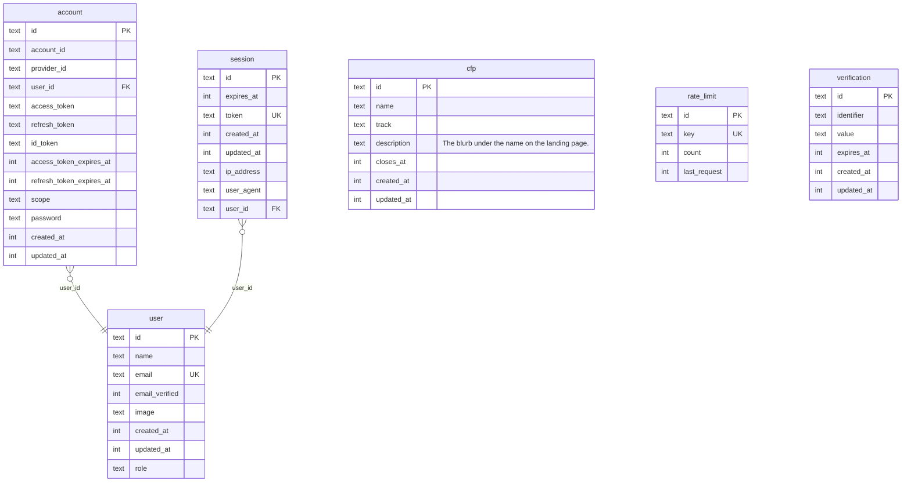

# Tables

| Name | Columns | Comment |
|------|---------|---------|
| [account](./account.md) | 13 |  |
| [cfp](./cfp.md) | 7 | A call for speakers.  `closes_at IS NULL` is a continuously running call; a date makes it an event-specific call that stops taking submissions at that moment. Both kinds are live at the same time, so nothing may assume a single current call.  There is no `status` column: closing a call *is* setting `closes_at`, and "open" is `closes_at IS NULL OR closes_at > now` — the same predicate the submission guard already has to run in SQL. A second source of truth for open-ness could only disagree with it.  Timestamp and id conventions follow Better Auth's generated tables rather than picking our own, so one migration stream stays internally consistent. |
| [rate_limit](./rate_limit.md) | 4 |  |
| [session](./session.md) | 8 |  |
| [user](./user.md) | 8 |  |
| [verification](./verification.md) | 6 |  |

---

## ER Diagram

