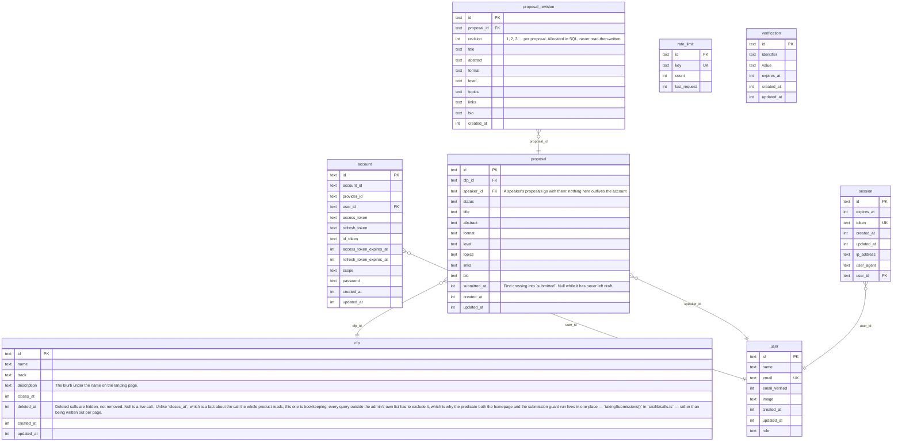

# Tables

| Name | Columns | Comment |
|------|---------|---------|
| [account](./account.md) | 13 |  |
| [cfp](./cfp.md) | 8 | A call for speakers.  `closes_at IS NULL` is a continuously running call; a date makes it an event-specific call that stops taking submissions at that moment. Both kinds are live at the same time, so nothing may assume a single current call.  There is no `status` column: closing a call *is* setting `closes_at`, and "open" is `closes_at IS NULL OR closes_at > now` — the same predicate the submission guard already has to run in SQL. A second source of truth for open-ness could only disagree with it.  Deleting is soft, and `deleted_at` is the one place that is not true of: it is a second thing a query has to ask, because a deleted call is neither open nor closed but gone from everywhere except the admin's own list, where it can be restored.  Timestamp and id conventions follow Better Auth's generated tables rather than picking our own, so one migration stream stays internally consistent. |
| [proposal](./proposal.md) | 14 | A pitch, belonging to a speaker and to the call it was pitched to.  The content columns are `notNull` with empty defaults rather than nullable: a draft is allowed to be half-written — the design's own example is "Untitled — something about WebGPU" — so emptiness is a normal state, not a missing value. Completeness is asserted when the status becomes `submitted`, which is the moment it starts to matter.  `topics` and `links` are JSON arrays rather than two more tables. Nothing queries across them yet — no screen filters by topic — and a field beats a table until something needs the join.  No `event_id` column yet: `event` does not exist, and a nullable column is a cheap `ALTER TABLE` once it does. |
| [proposal_revision](./proposal_revision.md) | 11 | An append-only snapshot of a proposal's content, written every time the speaker saves.  This exists so a reviewer's comment can be read against the wording it was written about: proposals stay editable for life, so without it, tidying an abstract would silently orphan the feedback on it. History cannot be reconstructed after the fact, which is why it is here before the review screens that consume it.  Status is not snapshotted — it is not content, and a comment is never about it. |
| [rate_limit](./rate_limit.md) | 4 |  |
| [session](./session.md) | 8 |  |
| [user](./user.md) | 8 |  |
| [verification](./verification.md) | 6 |  |

---

## ER Diagram

